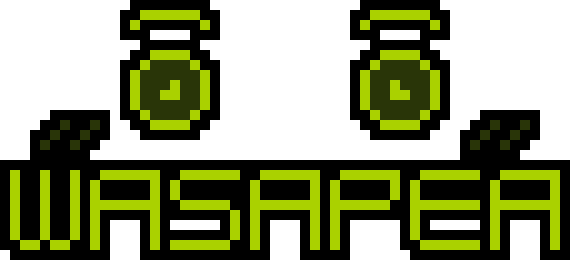

  
  <h3 align="center"> 🌿 WELCOME TO MY PROFILE 🌿 </h3>

  
  
  

  <h3 align="center"> 🌿 STATS 🌿 </h3>
  
  
  

  <h3 align="center"> 🌿 BIO 🌿 </h3>
  
 🕛 <strong>Timezone:</strong> Ho Chi Minh city, Vietnam (GMT+7)

  
 🏫 <strong>Studying At:</strong> VNUHCM - University of Science (🎓 Bachelor's Degree - Software Engineering)

  
 🏢 <strong>Working At:</strong> <i>None</i>

  
 🌟 <strong>Pursuing Career:</strong> Game Designer & Developer, especially on Rendering Engineering

  
 ⚙️ <strong>Using Engines:</strong>
     Unity Engine (mostly) and
     Godot Engine (sometimes)
  

  
 📌 <strong>Interested In:</strong>
    <ul>
      <li>🌲 Data Structures & Algorithms</li>
      <li>🖼️ Rendering Programming/Shaders (GLSL & HLSL)</li>
      <li>🕹️ Game Programming (Unity & Godot)</li>
      <li>➗ Game Mathematics</li>
      <li>🖌️ 2D Pixel Art (Aseprite)</li>
      <li>🎲 3D Sculpting/Modeling (Blender)</li>
      <li>🧠 Extended Reality - XR (VR/AR/MR)</li>
      <li>🗃️ Git</li>
    </ul>
  

  
 🎈 <strong>Hobbies:</strong>
    <ul>
      <li>📖 Books</li>
      <li>🏸 Badminton</li>
      <li>🏊🏻‍♂️ Swimming</li>
      <li>🍳 Cooking</li>
      <li>🎮 Games</li>
      <li>🎶 Musics</li>
    </ul>
  

  
 🐾 <strong>Pets:</strong>
    <ul>
      <li>🐶 Dogs</li>
      <li>😾 Cats</li>
    </ul>
  

  <h3 align="center"> 🌿 JOB EXPERIENCE 🌿 </h3>  
  <table align="center">
    <thead>
      <tr>
        <th>Job</th>
        <th>Roles</th>
        <th>Duration</th>
      </tr>
    </thead>
    <tbody>
      <tr>
        <td><i>None</i></td>
        <td><i>None</i></td>
        <td><i>None</i></td>
      </tr>
    </tbody>
  </table>

<!-- Talk more about attended Game Jams and Completed/WIP Game Projects -->